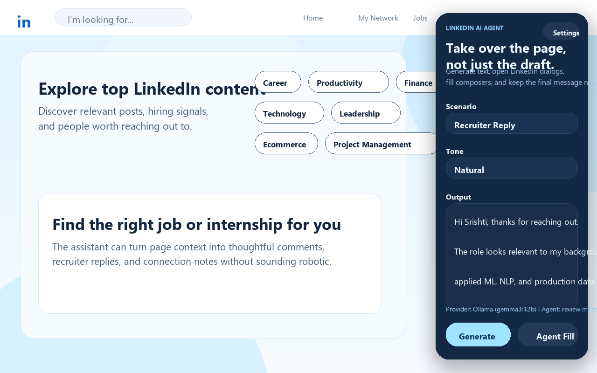
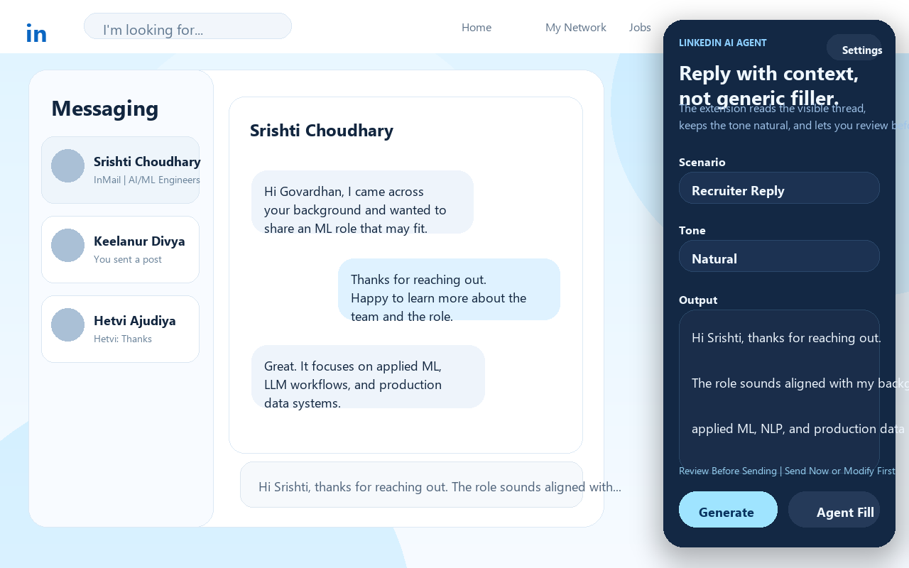
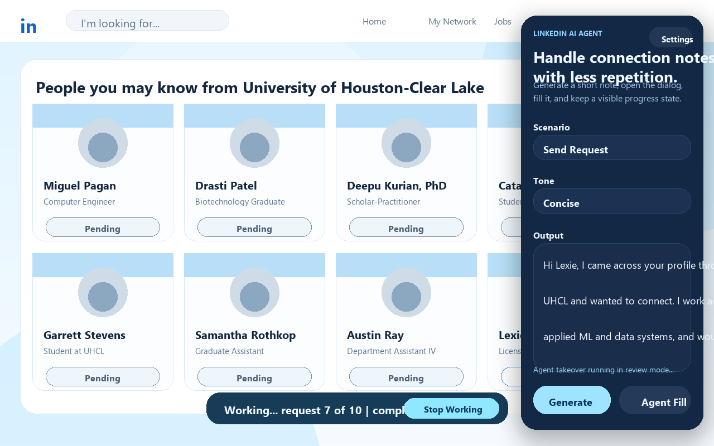
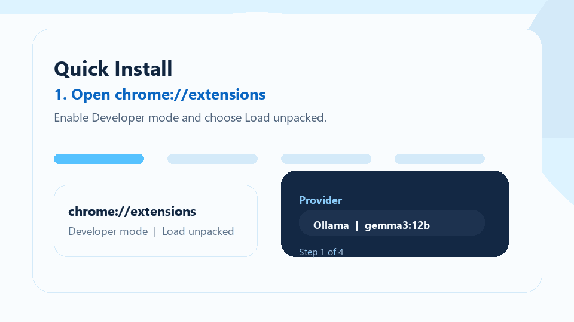
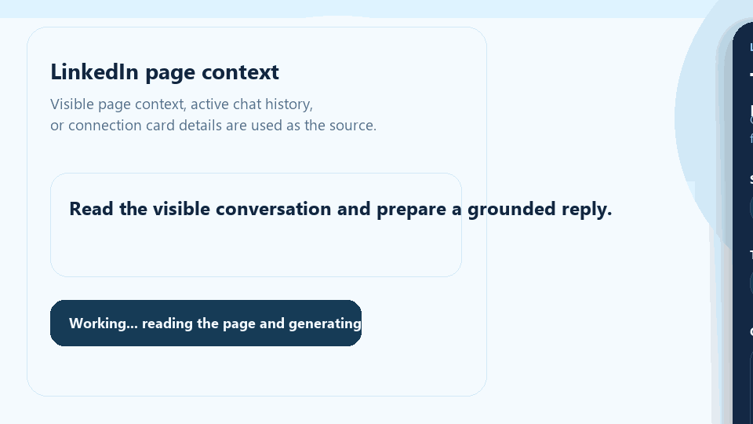

# LinkedIn Outreach Agent

I built this project to make LinkedIn outreach feel more natural, more personalized, and much less repetitive.

This is a Chrome extension that works directly on LinkedIn pages, reads the visible context, generates responses in my voice, and helps me handle recruiter replies, networking follow-ups, post comments, and connection requests.

What I wanted was not a generic AI writer that sounds polished but fake. I wanted something that stays grounded in my real profile, sounds like me, and helps me move faster without losing control over the final message.



## Tagline

Natural LinkedIn replies, recruiter responses, and connection outreach with browser-side automation and local or cloud LLM support.

## What this project includes

This repository contains the Chrome extension, including the LinkedIn overlay, model-provider configuration, shared prompt logic, and browser-agent workflows.

## Main features

- Uses my saved profile context and style guide so replies stay aligned with my real background
- Supports recruiter replies, post comments, networking follow-ups, connection acceptance replies, and connection requests
- Can read visible LinkedIn page context or message-thread context before drafting
- Supports OpenAI, Ollama, and OpenAI-compatible local model servers
- Includes a browser-agent mode that can open dialogs, fill fields, and help with repetitive LinkedIn actions
- Adds a review-first flow for recruiter replies so I can approve or edit the message before it is sent

## Screenshots

### Recruiter reply flow

The extension reads the visible conversation, drafts a single response in a natural tone, and pauses for review before sending.



### Connection request workflow

The browser agent can open connection flows, fill short notes, and keep visible progress while it works through a batch.



## Why I built it this way

I wanted something practical for real outreach, not just a demo.

When I'm replying to recruiters or sending networking messages, the hard part is usually not writing English. The hard part is staying specific, staying honest, and keeping the tone natural. A lot of AI-generated outreach sounds too polished, too eager, or too generic. This project is meant to help with that by grounding every draft in actual profile information and a simple voice guide.

I also wanted flexibility in model choice. Some days I may want to use OpenAI. Other times I may want to keep everything local with Ollama or another OpenAI-compatible server.

## Repository structure

`chrome-extension/`

- The main Chrome extension code
- Includes the LinkedIn overlay, settings page, popup, shared prompt logic, and background service worker

## How the Chrome extension works

The extension injects a floating assistant into LinkedIn pages. From there I can:

1. Choose a scenario like recruiter reply or send request
2. Either provide source text or let the agent use visible page context
3. Generate a draft with my selected model provider
4. Fill the LinkedIn composer directly
5. Review the message before sending when needed

For recruiter replies, the extension is designed to read the visible conversation first, understand the context, and generate a single reply that sounds like a real response rather than a list of AI variations.

## Model providers

The extension supports three provider modes:

### 1. Ollama

This is the default local setup.

- Base URL: `http://127.0.0.1:11434`
- Current default model: `gemma3:12b`

If the model is not available yet:

```powershell
ollama pull gemma3:12b
```

### 2. OpenAI

Use the OpenAI API if I want cloud-based generation.

- Base URL: `https://api.openai.com/v1`
- Model can be configured in extension settings

### 3. OpenAI-compatible local servers

This works for tools like LM Studio or other servers that expose an OpenAI-style API.

- Common local URL: `http://127.0.0.1:1234/v1`

## Installing the Chrome extension

1. Open `chrome://extensions`
2. Turn on Developer mode
3. Click `Load unpacked`
4. Select the `chrome-extension` folder
5. Open the extension settings and choose the provider you want
6. Save settings and open a fresh LinkedIn tab

## Demo

### Install flow



### Usage flow



## Key files

- `chrome-extension/manifest.json`
- `chrome-extension/src/content.js`
- `chrome-extension/src/background.js`
- `chrome-extension/src/shared.js`

## Responsible use

This project can help with drafting and browser automation, but I still treat it as an assistant, not a replacement for judgment.

That matters especially on LinkedIn. Messages should stay truthful, respectful, and relevant to the person I'm contacting. I do not want the tool inventing experience, over-claiming skills, or sending careless bulk outreach.

## Current limitations

- LinkedIn changes its DOM often, so selectors may need updates over time
- Local model performance depends on whether Ollama or another server is running correctly
- Fully autonomous browser actions should be used carefully and reviewed before scaling them up
- This project does not use a logged-in ChatGPT web session directly

## Future improvements

- Better selector coverage across more LinkedIn page types
- A cleaner connection-request queue with stronger progress tracking
- Built-in provider health checks from the extension UI
- Stronger recruiter intent presets like interested, need more details, and polite decline
- A local proxy option for safer API-key handling

## Personal note

For me, the most important part of this project is not automation by itself. It is making sure the output still feels human.

If a reply sounds like something I would never actually say, then the tool is not doing its job. The goal here is to reduce friction while keeping the message natural, specific, and honest.
